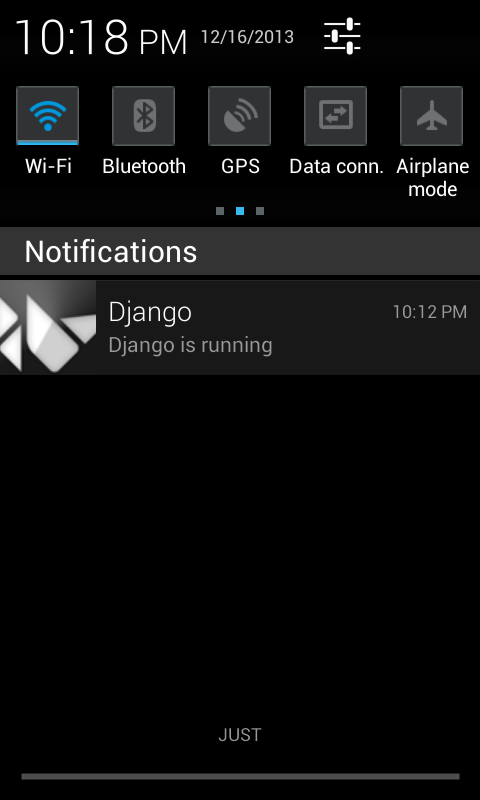
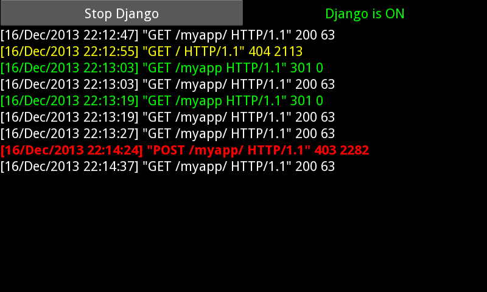

djandro
=======

Django on Android

A friend of mine wanted to get an offline version of his django site that he could carry around on his phone, so I made this app. It basically starts django as a service that runs in the background, and you can connect to it using your phone's browser.


<div align="center">
<span> </span>
</div>


## Requirements
- python-for-android
- django

## Steps
### 1. Get python-for-android
- Get your environment set-up by following this [link](http://python-for-android.readthedocs.org/en/latest/toolchain/).
- Downloading the .vbi image and running it in Virtualbox is the quickest option.

### 2. Distribute
Create your Arm distribution of Python
```
python-for-android$ ./distribute.sh -m "kivy django"
```
### 3. Build the app
```
python-for-android/dist/default$ ./build.py --package com.example.djandro \
  --name "Djandro" \
  --version 1 \
  --permission INTERNET \
  --dir path/to/djandro debug installd
```
`installd` will install if the phone is connected via USB. If you are using the VM and haven't configured USB, you can scp the .apk file to your local (non-virtual) machine or upload it somewhere and grab it from your phone, etc.

At this stage, you have a working version of django on your Android.

## Connect

1. Run the app. The first run can take a couple of minutes because python and the various media files have to get unpacked. Be patient.

2. **djandro** comes with a skeleton **django** app, called `myapp`. It simply displays your phone's current time. To try it, open the phone's browser to `http://localhost:8000/myapp/`. At this stage you might feel very excited, but don't call all your friends just yet. Using a browser as digital clock isn't exactly revolutionary, so they'll be much more impressed if you can show them your phone is running your own app.

3. Copy your own django app - called, say, `yourapp` - inside the `service` folder. It should be at the same level as `myapp`.

4. Update django config files:

- `service/urls.py`
```
urlpatterns = patterns('',
    # Examples:
    # url(r'^$', 'djandro.views.home', name='home'),
    url(r'^myapp/', include('myapp.urls')),
    url(r'^yourapp/', include('yourapp.urls')),   # <-- Add this
    url(r'^admin/', include(admin.site.urls)),
)
```
- `service/settings.py`:
```
INSTALLED_APPS = (
(...)
    'myapp',
    'yourapp',   # <-- Add this
)
```
Note: `settings.py` can be altogether replaced with the one from your own django project, just remember that the database engine has to be sqlite3.


## Connecting from other devices

The site should also be available from other devices connected to the same network (replace `localhost` with the IP of the one running django). When no networks are in range, your device can be used as a router at the same time as it serves Django:

Android Settings > More... > Tethering & portable hotspot > Portable Wi-Fi hotspot (check)
